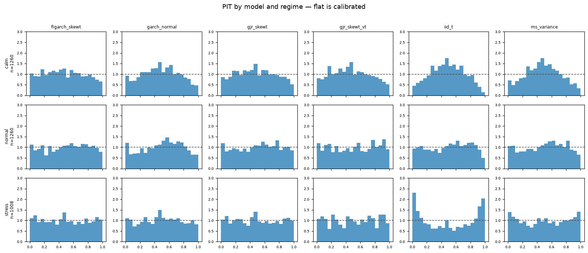
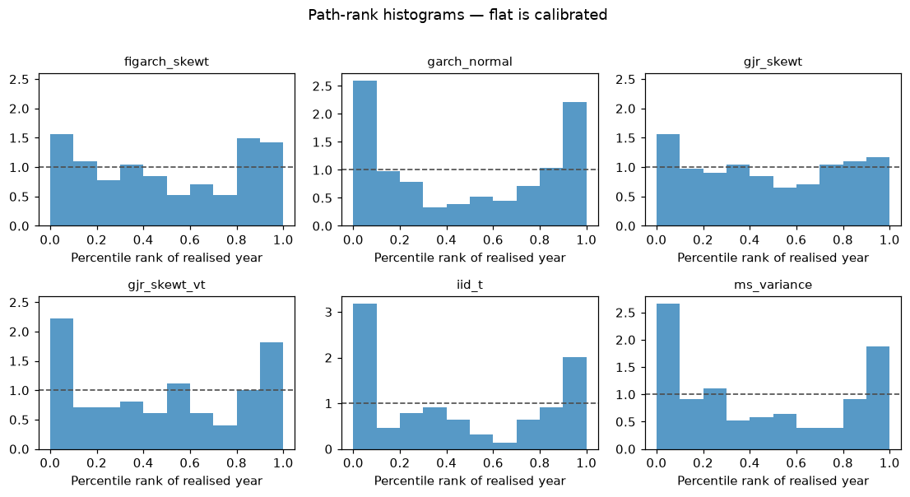
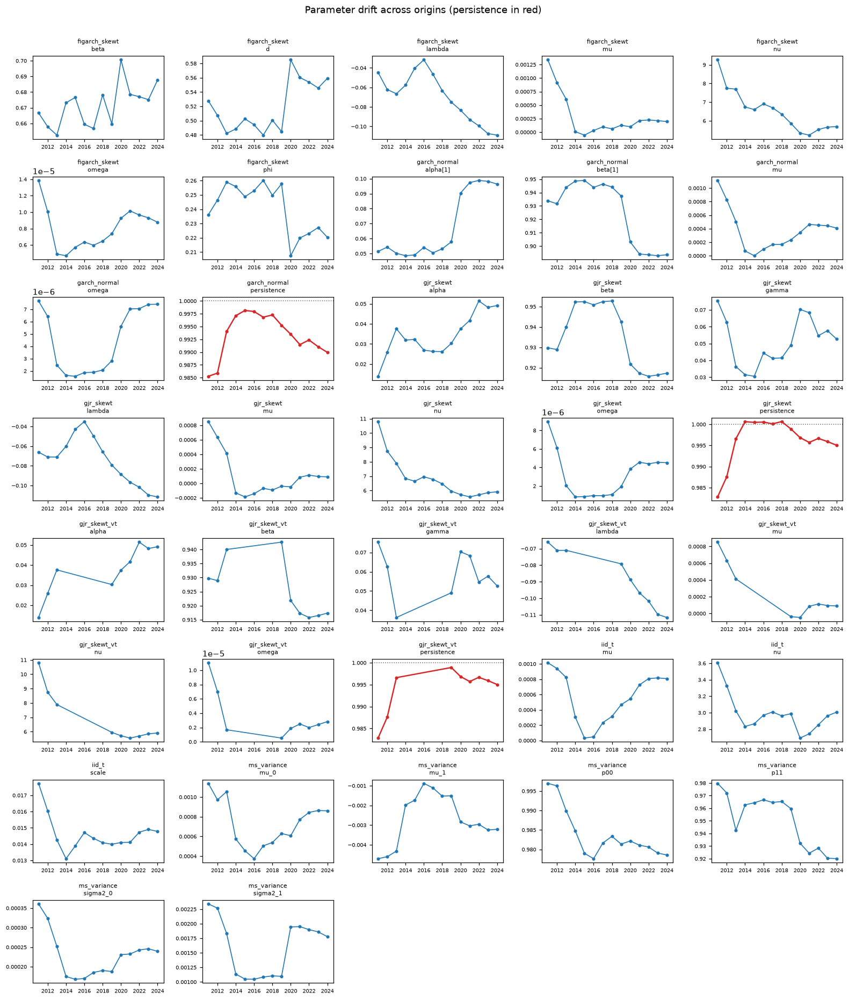

# Brent scenario generators — out-of-time model comparison

*Companion to [validation.md](validation.md), which is the in-sample
descriptive check on the champion fitted to all data. This report is the
pre-registered, out-of-time comparison that selected it.*

## Summary

Six candidate generators were compared out of time at fourteen year-end
origins, 2011–2024, under a ranking rule fixed and committed before the
first result existed. GJR-GARCH(1,1,1) with skewed-t innovations won the
pre-registered composite on the 2011–2018 selection origins (weighted
score 1.913, top-two at 7 of 8 origins) and held on the 2019–2024
confirmation origins (2.156, top-two at 5 of 6). It is retained as the
champion.

The win is narrower and more specific than the scoreboard suggests.
FIGARCH(1,d,1) with the same innovations is second on both periods (2.388,
2.266), and on the confirmation origins it beats the champion on both
density losses — negative log-likelihood and tail-weighted CRPS — with
Diebold–Mariano statistics of −0.91 and −1.34 (p = 0.36, 0.18): nominally
better, not significantly so. The champion holds the composite on the two
*risk* losses, 99% exceedance error and path coverage. So the evidence
says: for VaR and scenario coverage, GJR; for density forecasting, the two
are indistinguishable and FIGARCH is the better-calibrated of the pair.

Three findings qualify the champion and are the substance of §9: its own
fit is non-stationary (persistence 1.00012–1.00066) at five of the
fourteen origins; it is under-confident in calm years and calibrated in
normal and stress years; and at the one origin whose test window is 2020,
no candidate — including it — produced a year like the one that happened.

## 1. Pre-registration

Run matched the pre-registration (`sha256:15aa66f01f4562b4…`).

**Amendment 1 (post-hoc).** A candidate whose fit raises at an origin now takes the worst rank on all four losses there, instead of being dropped and the survivors re-ranked. Scoring a model only where it happened to work is survivorship bias. Both rulings are shown below. The champion is **the same under both**.

Origins [2011, 2012, 2013, 2014, 2015, 2016, 2017, 2018, 2019, 2020, 2021, 2022, 2023, 2024]; selection [2011, 2012, 2013, 2014, 2015, 2016, 2017, 2018]; confirmation [2019, 2020, 2021, 2022, 2023, 2024]. 2000 paths per (model, origin), seed 2024, horizon 252 days, stress weight 2.0. Ranking losses: `mean_nll`, `mean_tail_crps`, `exc99_abs_error`, `path_coverage_loss`. The full plan is in `docs/preregistration.md`.

## 2. Scoreboard

Lower is better. Rank stability is the fraction of origins on which the
model is top-two on the mean of the four ranks.

**Selection origins, 2011–2018**

| model | step | amended score | rank stability | original score (origins scored) |
|---|---|---|---|---|
| gjr_skewt | 2 | 1.913 | 0.875 | 1.913 (8) |
| figarch_skewt | 4 | 2.388 | 0.750 | 2.388 (8) |
| ms_variance | 5 | 3.525 | 0.125 | 3.525 (8) |
| garch_normal | 1 | 3.775 | 0.000 | 3.775 (8) |
| iid_t | 0 | 4.312 | 0.125 | 4.312 (8) |
| gjr_skewt_vt | 3 | 5.088 | 0.125 | 2.958 (3) |

**Confirmation origins, 2019–2024**

| model | step | amended score | rank stability |
|---|---|---|---|
| gjr_skewt | 2 | 2.156 | 0.833 |
| figarch_skewt | 4 | 2.266 | 0.667 |
| gjr_skewt_vt | 3 | 3.391 | 0.333 |
| garch_normal | 1 | 4.328 | 0.000 |
| iid_t | 0 | 4.422 | 0.167 |
| ms_variance | 5 | 4.438 | 0.000 |

Champion under both rulings: `gjr_skewt`. Confirmation agrees under both.

### 2.1 Which loss the composite is won on

Mean rank per loss; lower is better.

| loss | gjr_skewt (selection) | figarch_skewt (selection) | gjr_skewt (confirmation) | figarch_skewt (confirmation) |
|---|---|---|---|---|
| Mean NLL | 1.500 | 1.750 | 2.000 | 1.833 |
| Mean tail CRPS | 1.750 | 2.625 | 2.500 | 2.000 |
| |99% exceedance error| | 2.688 | 2.375 | 1.917 | 2.167 |
| Path coverage loss | 2.125 | 2.625 | 2.333 | 2.833 |

## 3. Scores by regime

Four losses averaged within each regime of the test window.

| model | regime | mean_nll | mean_tail_crps | exc99_abs_error | path_coverage_loss |
|---|---|---|---|---|---|
| figarch_skewt | calm | -2.90369 | 0.00010 | 0.00587 | 0.25935 |
| garch_normal | calm | -2.86168 | 0.00010 | 0.00829 | 0.35702 |
| gjr_skewt | calm | -2.89966 | 0.00010 | 0.00356 | 0.29375 |
| gjr_skewt_vt | calm | -2.92247 | 0.00010 | 0.00595 | 0.30303 |
| iid_t | calm | -2.78108 | 0.00012 | 0.00921 | 0.39971 |
| ms_variance | calm | -2.79665 | 0.00011 | 0.00673 | 0.37723 |
| figarch_skewt | normal | -2.59656 | 0.00014 | 0.00352 | 0.29775 |
| garch_normal | normal | -2.53126 | 0.00014 | 0.01143 | 0.31379 |
| gjr_skewt | normal | -2.59259 | 0.00014 | 0.00435 | 0.26678 |
| gjr_skewt_vt | normal | -2.56084 | 0.00014 | 0.00460 | 0.24642 |
| iid_t | normal | -2.57045 | 0.00014 | 0.00435 | 0.31965 |
| ms_variance | normal | -2.58299 | 0.00014 | 0.00908 | 0.28520 |
| figarch_skewt | stress | -2.14740 | 0.00022 | 0.00591 | 0.34770 |
| garch_normal | stress | -2.09254 | 0.00022 | 0.00984 | 0.38247 |
| gjr_skewt | stress | -2.14657 | 0.00022 | 0.00595 | 0.28947 |
| gjr_skewt_vt | stress | -2.10097 | 0.00028 | 0.00786 | 0.41784 |
| iid_t | stress | -2.00286 | 0.00026 | 0.01583 | 0.34208 |
| ms_variance | stress | -2.02501 | 0.00024 | 0.01286 | 0.33982 |

## 4. Crisis years

Every stress-labelled origin, with the percentile rank of the realised year within each model's simulated distribution and the 99% exceedance count out of 252. A rank near 0 or 1 means the realised year sat in the tail of what the model imagined. **2008 is absent**: no origin has enough history before it, since the data begins in 2007 and the first origin is 2011.

### 4.1 Per-origin losses and ranks at stress origins

| origin_year | regime | model | mean_nll | mean_tail_crps | exc99_abs_error | path_coverage_loss | rank_max_drawdown | rank_worst_day |
|---|---|---|---|---|---|---|---|---|
| 2014 | stress | figarch_skewt | -2.17595 | 0.00017 | 0.00587 | 0.34986 | 0.90900 | 0.18400 |
| 2014 | stress | garch_normal | -2.15114 | 0.00018 | 0.01381 | 0.38364 | 0.86800 | 0.08800 |
| 2014 | stress | gjr_skewt | -2.18255 | 0.00017 | 0.00206 | 0.20595 | 0.76100 | 0.36400 |
| 2014 | stress | iid_t | -2.08891 | 0.00019 | 0.00587 | 0.31991 | 0.89300 | 0.56050 |
| 2014 | stress | ms_variance | -2.15178 | 0.00018 | 0.00984 | 0.32005 | 0.82400 | 0.21950 |
| 2015 | stress | figarch_skewt | -2.19512 | 0.00015 | 0.00603 | 0.23700 | 0.32750 | 0.43750 |
| 2015 | stress | garch_normal | -2.17974 | 0.00015 | 0.00190 | 0.29241 | 0.27350 | 0.25550 |
| 2015 | stress | gjr_skewt | -2.19562 | 0.00015 | 0.01000 | 0.17664 | 0.27550 | 0.48650 |
| 2015 | stress | iid_t | -2.07024 | 0.00016 | 0.00206 | 0.31500 | 0.26550 | 0.75400 |
| 2015 | stress | ms_variance | -2.18098 | 0.00016 | 0.00206 | 0.23709 | 0.22100 | 0.50850 |
| 2019 | stress | figarch_skewt | -2.06410 | 0.00035 | 0.00984 | 0.48464 | 0.99850 | 0.00350 |
| 2019 | stress | garch_normal | -1.89050 | 0.00036 | 0.01381 | 0.48914 | 0.99700 | 0.00000 |
| 2019 | stress | gjr_skewt | -2.07166 | 0.00035 | 0.00984 | 0.47877 | 0.98650 | 0.00550 |
| 2019 | stress | gjr_skewt_vt | -2.07150 | 0.00035 | 0.01381 | 0.48277 | 0.99150 | 0.00300 |
| 2019 | stress | iid_t | -1.83496 | 0.00048 | 0.04556 | 0.45791 | 0.99950 | 0.03550 |
| 2019 | stress | ms_variance | -1.68168 | 0.00041 | 0.02968 | 0.47055 | 0.99700 | 0.00000 |
| 2021 | stress | figarch_skewt | -2.15443 | 0.00020 | 0.00190 | 0.31932 | 0.79500 | 0.12500 |
| 2021 | stress | garch_normal | -2.14878 | 0.00020 | 0.00984 | 0.36468 | 0.76600 | 0.04100 |
| 2021 | stress | gjr_skewt | -2.13644 | 0.00021 | 0.00190 | 0.29650 | 0.75250 | 0.13000 |
| 2021 | stress | gjr_skewt_vt | -2.13043 | 0.00021 | 0.00190 | 0.35291 | 0.81700 | 0.08600 |
| 2021 | stress | iid_t | -2.01731 | 0.00023 | 0.00984 | 0.27550 | 0.78700 | 0.31800 |
| 2021 | stress | ms_variance | -2.08558 | 0.00021 | 0.00984 | 0.33159 | 0.70450 | 0.04350 |

## 5. Calibration — PIT

Probability-integral-transform values of the realised return under each
day's forecast density. Uniform means calibrated; a hump means the
densities are too wide (under-confident); a U means too narrow
(over-confident). χ² is over 20 bins; because consecutive PITs are mildly
dependent and n is large, the p-values are anti-conservative and effect
sizes (KS distance from uniform, largest single-bin deviation from 0.05)
are reported beside them.

### 5.1 Pooled over all origins

| model | shape | χ² p | KS | max-bin dev |
|---|---|---|---|---|
| figarch_skewt | hump | 0.0167 | 0.0193 | 0.0115 |
| garch_normal | hump | 0.0000 | 0.0489 | 0.0194 |
| gjr_skewt | hump | 0.0004 | 0.0223 | 0.0160 |
| gjr_skewt_vt | flat | 0.0996 | 0.0232 | 0.0138 |
| iid_t | hump | 0.0020 | 0.0213 | 0.0149 |
| ms_variance | hump | 0.0000 | 0.0331 | 0.0146 |

`gjr_skewt_vt` is judged on fewer days; see §5.3.

### 5.2 By regime of the test window

| model | calm | normal | stress |
|---|---|---|---|
| gjr_skewt | hump (0.000) | flat (0.099) | flat (0.269) |
| figarch_skewt | hump (0.022) | flat (0.137) | flat (0.352) |
| garch_normal | hump (0.000) | hump (0.000) | flat (0.067) |
| gjr_skewt_vt | hump (0.000) | flat (0.130) | flat (0.235) |
| iid_t | hump (0.000) | hump (0.002) | **U** (0.000) |
| ms_variance | hump (0.000) | hump (0.001) | **U** (0.012) |

### 5.3 On common days

Restricted to the 9 origins at which every candidate
fitted, so all six are judged on identical days.

| model | shape | χ² p | KS | max-bin dev |
|---|---|---|---|---|
| figarch_skewt | flat | 0.1220 | 0.0259 | 0.0143 |
| garch_normal | hump | 0.0000 | 0.0564 | 0.0244 |
| gjr_skewt | hump | 0.0079 | 0.0276 | 0.0160 |
| gjr_skewt_vt | flat | 0.0996 | 0.0232 | 0.0138 |
| iid_t | hump | 0.0042 | 0.0342 | 0.0174 |
| ms_variance | hump | 0.0000 | 0.0462 | 0.0187 |

## 6. Path-rank histograms

Percentile rank of each realised-year statistic inside the 2000 simulated
paths, pooled over origins and statistics. Same reading as §5.

## 7. Parameter drift

Each fitted parameter against origin year. The 1.0 line in the persistence
panels is the stationarity boundary.

### 7.1 Persistence by origin

| origin_year | garch_normal | gjr_skewt | gjr_skewt_vt | figarch (d) | gjr gamma | gjr nu | non_stationary |
|---|---|---|---|---|---|---|---|
| 2011 | 0.98528 | 0.98281 | 0.98281 | 0.52774 | 0.07531 | 10.80161 | - |
| 2012 | 0.98590 | 0.98759 | 0.98759 | 0.50723 | 0.06268 | 8.75260 | - |
| 2013 | 0.99406 | 0.99660 | 0.99660 | 0.48207 | 0.03630 | 7.89171 | - |
| 2014 | 0.99712 | 1.00063 | n/a | 0.48836 | 0.03154 | 6.83504 | gjr_skewt |
| 2015 | 0.99814 | 1.00047 | n/a | 0.50253 | 0.03057 | 6.65142 | gjr_skewt |
| 2016 | 0.99794 | 1.00054 | n/a | 0.49417 | 0.04436 | 6.95923 | gjr_skewt |
| 2017 | 0.99683 | 1.00012 | n/a | 0.47971 | 0.04128 | 6.77856 | gjr_skewt |
| 2018 | 0.99727 | 1.00066 | n/a | 0.50064 | 0.04148 | 6.46809 | gjr_skewt |
| 2019 | 0.99524 | 0.99891 | 0.99891 | 0.48462 | 0.04910 | 5.95834 | - |
| 2020 | 0.99350 | 0.99686 | 0.99686 | 0.58508 | 0.07032 | 5.71830 | - |
| 2021 | 0.99147 | 0.99572 | 0.99572 | 0.56025 | 0.06834 | 5.55814 | - |
| 2022 | 0.99237 | 0.99667 | 0.99667 | 0.55385 | 0.05469 | 5.69917 | - |
| 2023 | 0.99106 | 0.99591 | 0.99591 | 0.54566 | 0.05767 | 5.85379 | - |
| 2024 | 0.98995 | 0.99504 | 0.99504 | 0.55923 | 0.05270 | 5.91246 | - |

The champion's persistence sits at or above 1.0 at 2014–2018, exactly the 5 origins at which the variance-targeted variant cannot be fitted (1.00012 to 1.00066), and in 0.98281–0.99891 everywhere else. Its ν falls monotonically from 10.80 (2011) to 5.56 (2021) as the sample absorbs 2014–15 and 2020, then stabilises: the model is being told the tails are steadily fatter than it first thought.

## 8. Diebold–Mariano vs the champion

Confirmation origins pooled; Newey–West HAC variance, lag 10. A negative
statistic means the row model's loss is lower than the champion's.

| model | n_days | nll_stat | nll_p | tail_crps_stat | tail_crps_p |
|---|---|---|---|---|---|
| figarch_skewt | 1512 | -0.910 | 0.363 | -1.344 | 0.179 |
| garch_normal | 1512 | 2.409 | 0.016 | 0.582 | 0.560 |
| gjr_skewt_vt | 1512 | 2.792 | 0.005 | 1.751 | 0.080 |
| iid_t | 1512 | 4.033 | 0.000 | 1.612 | 0.107 |
| ms_variance | 1512 | 2.388 | 0.017 | 1.109 | 0.268 |

## 9. Failure modes

### 9.1 What the composite win is made of

The ranking rule averages four per-origin losses. Broken out, the champion
and FIGARCH tell opposite stories in the two periods. On selection the
champion wins three of four, including both density losses (mean rank
1.50 vs 1.75 on NLL, 1.75 vs 2.63 on tail CRPS). On confirmation it loses
both density losses (2.00 vs 1.83, 2.50 vs 2.00) and holds the composite
only through exceedance error (1.92 vs 2.17) and path coverage (2.33 vs
2.83). The champion therefore survives confirmation as a risk model, not
as a density model. Had the pre-registered rule weighted density fit
alone, the confirmation period would have preferred FIGARCH; it did not,
the rule was fixed in advance, and the selection stands. But the report
should not claim more than the rule delivered.

### 9.2 One mechanism behind every symptom

The in-sample validation (validation.md §4) found the champion sits on the
real bootstrap median for every statistic and yet over-disperses
volatility across simulated years by 2.13x while under-dispersing kurtosis
by 0.34x. The backtest explains why, and it is one mechanism.

The real autocorrelation of squared returns decays fast at short lags and
slowly thereafter — the hyperbolic signature of long memory. GJR-GARCH(1,1)
can only decay geometrically. The maximum-likelihood fit approximates the
slow tail the only way it can: by pushing persistence toward 1. On the
full sample it reaches 0.9954, a variance half-life of about 150 trading
days; at the 2014–2018 origins it crosses 1 (1.00012 to 1.00066), at which
point the model has no finite long-run variance at all. Those are exactly
the five origins at which the variance-targeted variant cannot be fitted —
there is nothing to target.

A near-integrated variance holds shocks too long. Three consequences
follow, and all three appear in the tables. Simulated years wander into
sustained high-variance states the market never held for a year (the
2.13x, and the 5th/95th-percentile mismatches of 2.11x and 2.60x that ride
on it). One-day densities are too wide in quiet periods, which is the
calm-regime under-confidence in §5.2 (χ² p = 0.0001). And the model has no
way to make an isolated jump — a smooth recursion with ν ≈ 5.6 innovations
generates fat tails by *raising σ for a while*, not by placing one extreme
day — which is the kurtosis under-dispersion (synthetic 252-day excess
kurtosis reaches 9.3 where real windows reach 26.8).

FIGARCH fixes the shape, not the tails: with a fractional-integration
parameter d it decays hyperbolically without integrating, which is why it
is better calibrated on common days (flat, p = 0.122, against the
champion's hump at p = 0.008) and nominally better on both density losses
out of sample. It carries no leverage term, and it still loses the
composite. The two runners-up each have half of the answer.

### 9.3 What the regime split shows

Pooled PIT histograms were misleading in both directions. Split by the
realised volatility of the test window, the champion is under-confident
only in calm years and reads flat in normal (p = 0.099) and stress
(p = 0.269) years: it spreads density wider than a quiet year needs, which
for a stress tool is the benign direction, and it is calibrated where
calibration matters.

The split also exposes the static-width failure that pooling averaged
away. The iid Student-t and the two-regime Gaussian mixture flip from hump
in calm years to U in stress years — one width for all conditions means
over-spreading when quiet and under-spreading when it counts. In the
stress rows the iid model puts 11.5% of realisations in a bin that should
hold 5%; in the 2020 window it took 14 exceedances at the 99% level
against 2.5 expected, the mixture 10, the GARCH family 5–6. That number is
the argument for a conditional variance at all, and it is why regimes
without fat-tailed shocks finished last on confirmation: the mixture can
switch its width but cannot make the days.

### 9.4 Nobody covered 2020

At the origin dated end-2019, every candidate was fitted on data through
December 2019 and asked for 2,000 years of 2020. Against the year that
happened, every one of them placed the realised drawdown and realised
volatility at rank ≈ 0.99 and the realised worst day at rank ≈ 0.00 — the
real year sat outside essentially everything any model imagined. This is
not a defect of the champion relative to the others; it is the limit of
the method. A fit-then-simulate generator conditions on the volatility
state at the origin, and in December 2019 that state was calm. The
one-day filter, which *reacts* to realised shocks, remained calibrated
through 2020 (stress-regime PIT flat). The 252-day paths, which had to
*anticipate*, did not. A scenario generator cannot forecast a regime it
has never seen from a state that gives no warning; what it can do — and
what the stress-scenario use of this model must rest on — is generate that
regime *conditionally*, by starting paths from a stressed variance state
rather than from today's. That is the `initial_var` choice, and it is the
difference between a tool that reproduces history and one that extends
it.

### 9.5 The unbalanced-availability amendment

The pre-registered rule dropped a failed candidate from an origin and
re-ranked the rest. Under that rule the variance-targeted variant finished
third on selection while being scored on only 3 of 8 origins. Amendment 1,
recorded post hoc in `docs/preregistration.md` with a new hash, assigns a
failed candidate the worst rank at that origin: a generator that cannot
produce scenarios has failed there, and scoring it only where it succeeds
is survivorship bias. It moves that variant to last (5.088). The champion
and the confirmation verdict are unchanged under both rulings, and both
scoreboards are shown in §2.

The variance-targeting experiment itself is closed: pinning ω to the
sample variance did not improve calibration where it could be fitted, and
could not be fitted where it was most needed. The inflated long-run
variance is a symptom of persistence, not its cause.

### 9.6 What I would try next, in order

1. **Asymmetric long memory.** FIAPARCH or HYGARCH with skewed-t
   innovations, or a two-component GJR: the evidence says the data want
   both the hyperbolic decay FIGARCH has and the leverage term GJR has.
   This is the direct successor and the first experiment.
2. **Jumps in the return equation.** A compound-Poisson jump term attacks
   the kurtosis under-dispersion at its source and should let persistence
   fall, because the recursion no longer has to manufacture jumps as
   regimes.
3. **Regimes with fat shocks.** MS-GARCH or a Markov-switching model with
   t innovations — the mixture's failure was the Gaussian within regime,
   not the switching.
4. **Conditional stress generation** as a first-class interface: simulate
   from a specified variance quantile or from a named historical stress
   state, and validate the resulting paths against the stressed years
   rather than against the bootstrap of the whole history. This is where
   §9.4 points.
5. **Reference-side checks not yet run**: a rolling-real-window overlay
   beside the bootstrap band, and a block-length sweep. The 20-day block
   is defensible a priori and its effect on the volatility band width
   remains asserted rather than shown.
